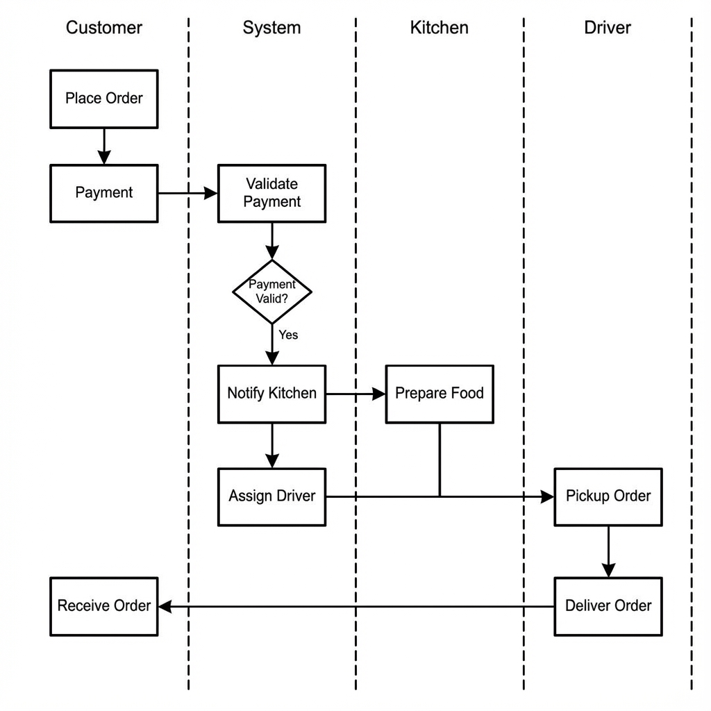
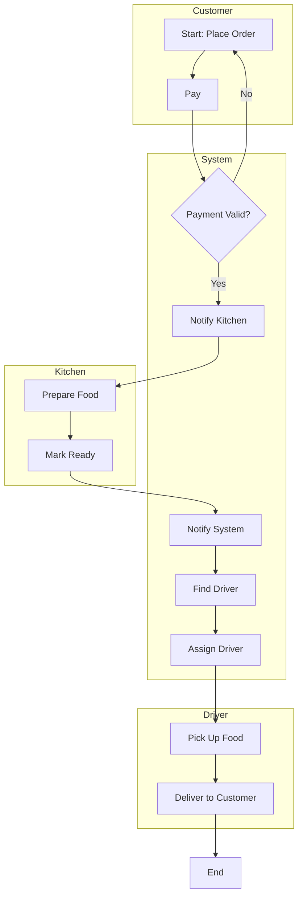
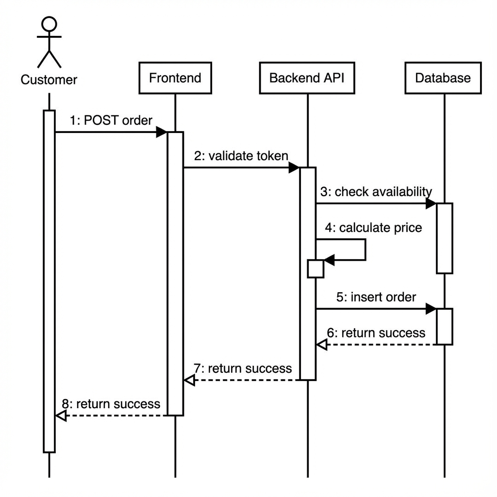
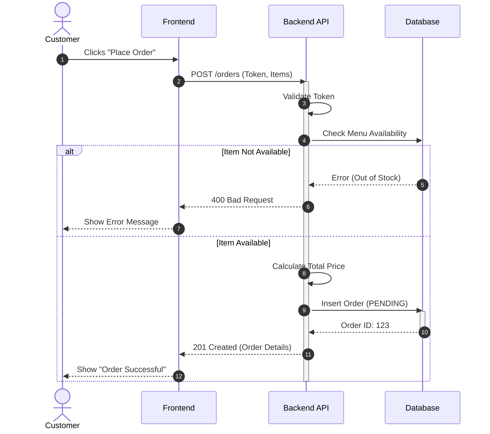
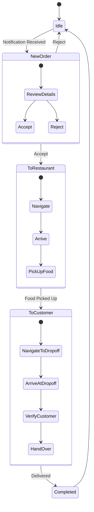

# Behavioral Diagrams

This document captures the dynamic behavior of the system using UML diagrams.

---

## 1. Swimlane Diagram (Order Fulfillment)
**Scope**: Cross-functional process flow from Customer to Driver.



```mermaid
%%{init: {'theme': 'neutral'}}%%
c4Context
    title Order Fulfillment Process

    Container_Boundary(c1, "Order Fulfillment") {
        Component(customer, "Customer", "Places Order")
        Component(system, "System", "Validates & Assigns")
        Component(kitchen, "Kitchen", "Prepares Food")
        Component(driver, "Driver", "Delivers")
    }
```
*Note: Mermaid doesn't support standard UML Swimlanes perfectly in all viewers, so we use a Sequence diagram with "participants" or a Flowchart with subgraphs to simulate it. Below is a Flowchart version representing Swimlanes.*



---

## 2. Sequence Diagram (Order Placement)
**Scope**: Detailed interaction between objects during order placement.





---

## 3. Activity Diagram (Driver Delivery Flow)
**Scope**: The step-by-step workflow of a driver.

> **Note**: Image generation quota reached. Please refer to the Mermaid diagram below or generate manually.


