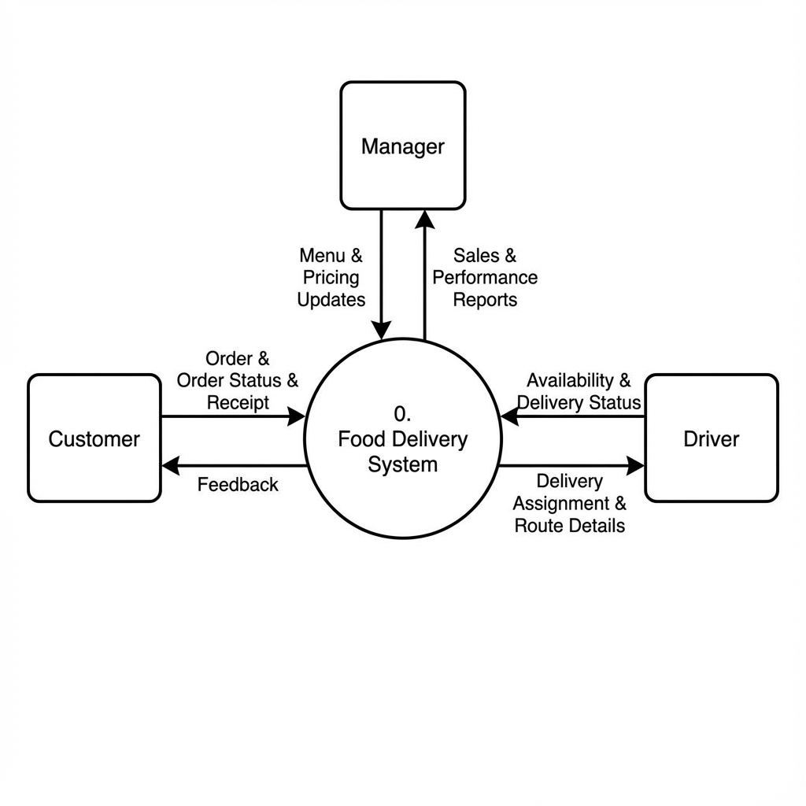
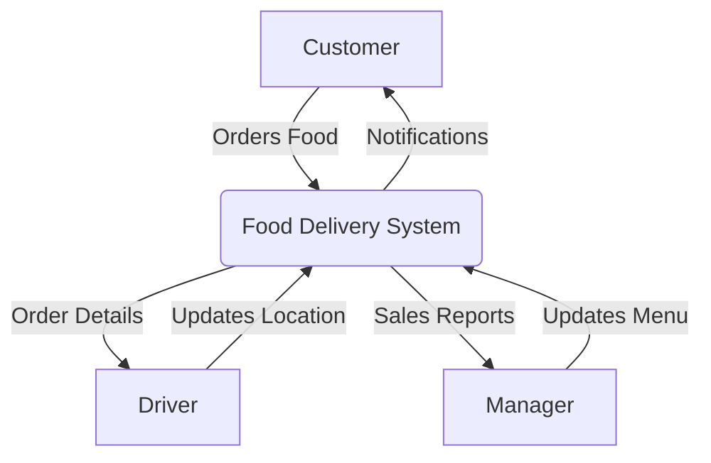
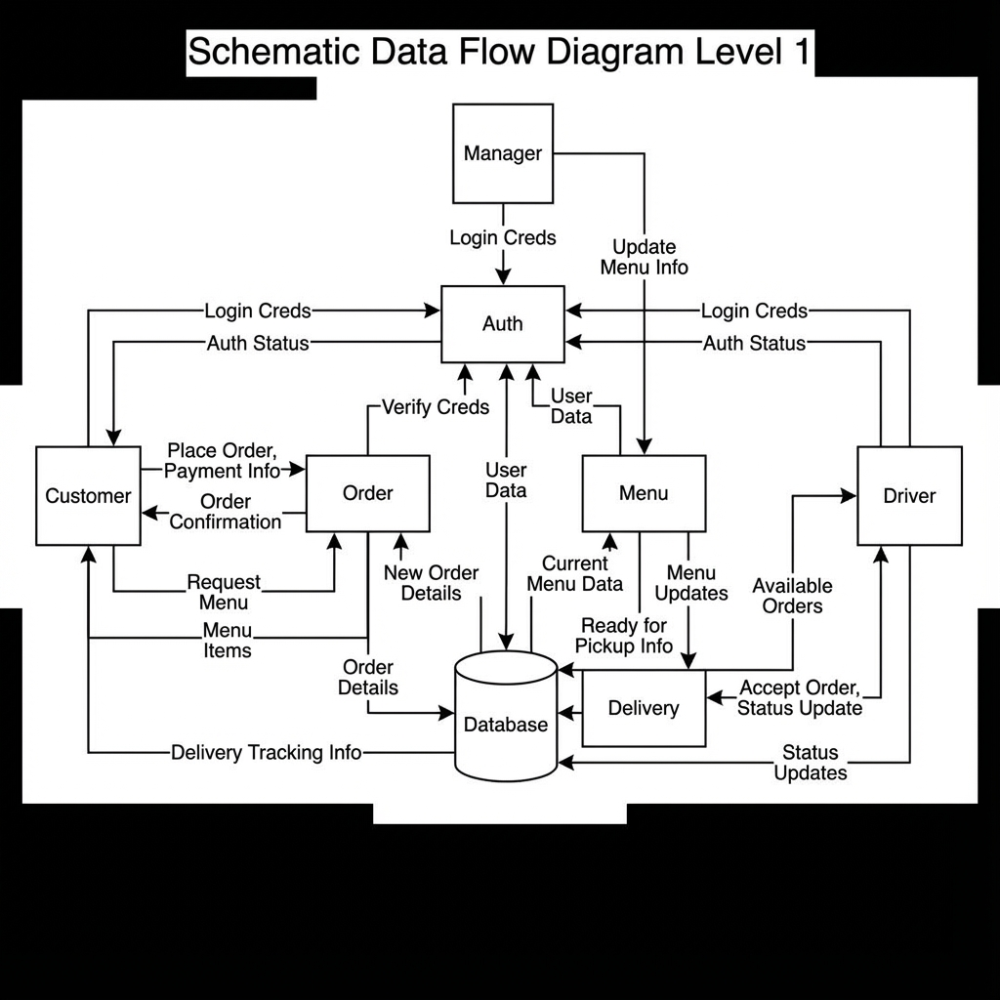
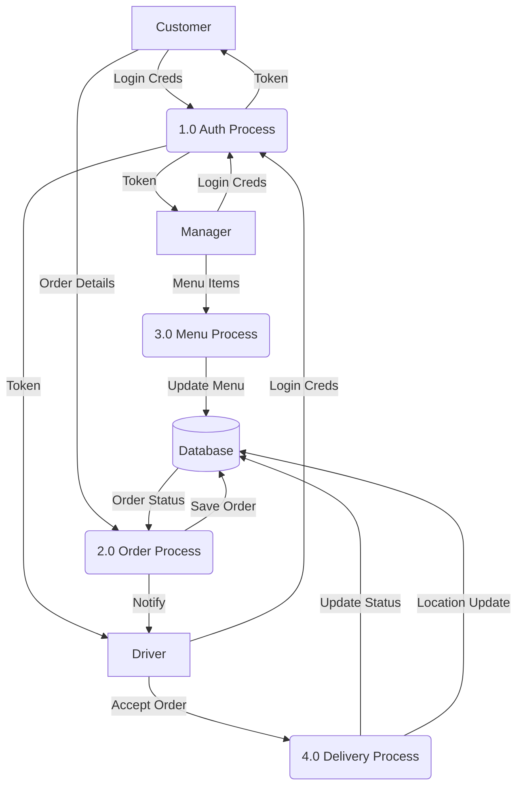
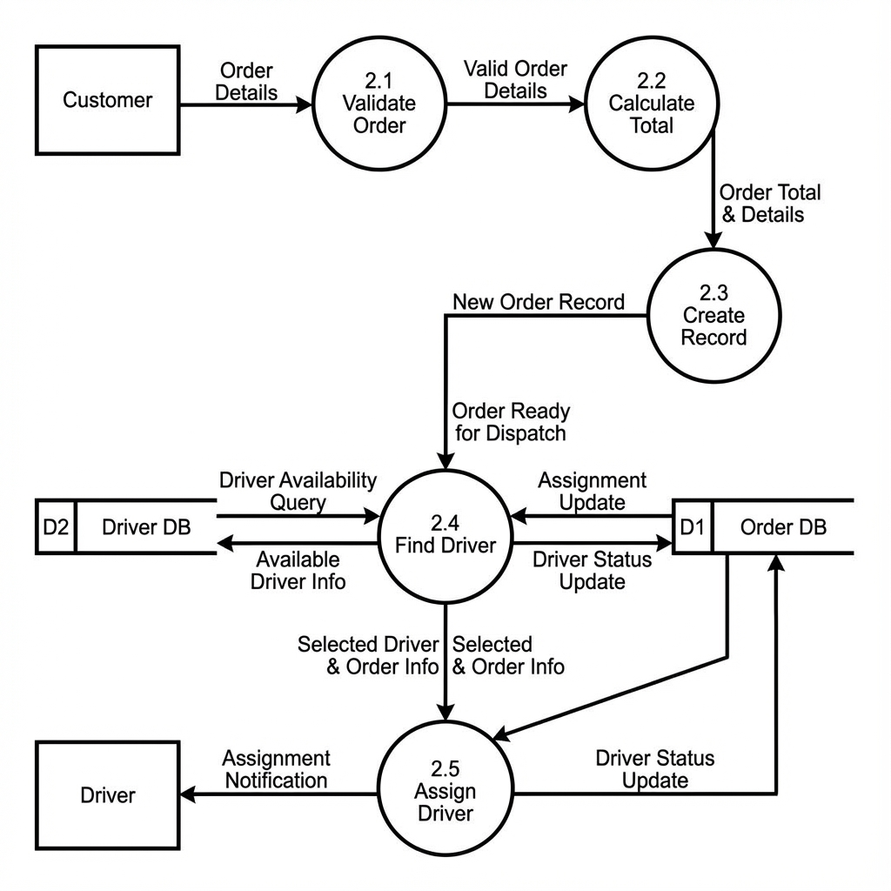
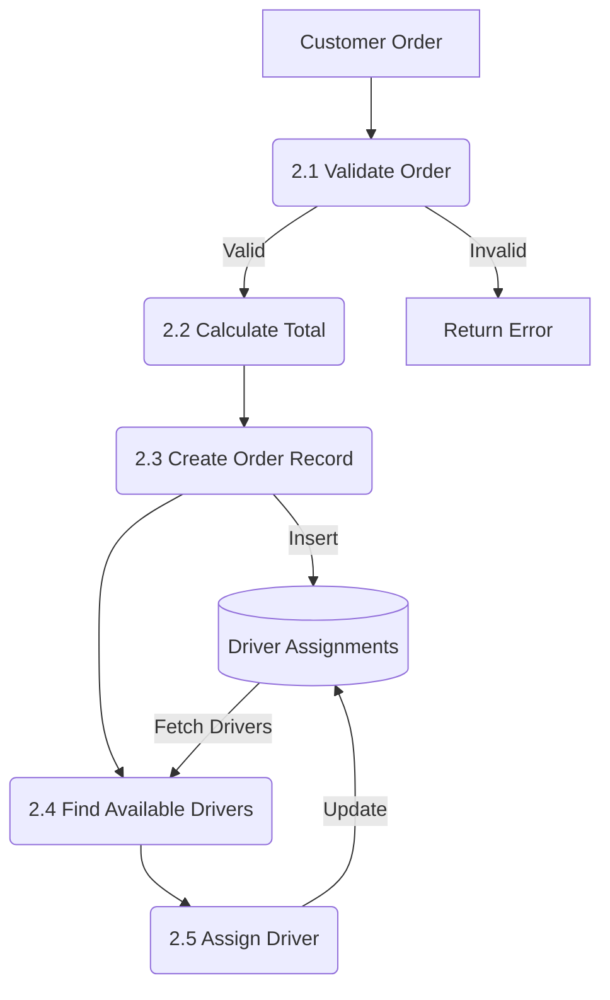
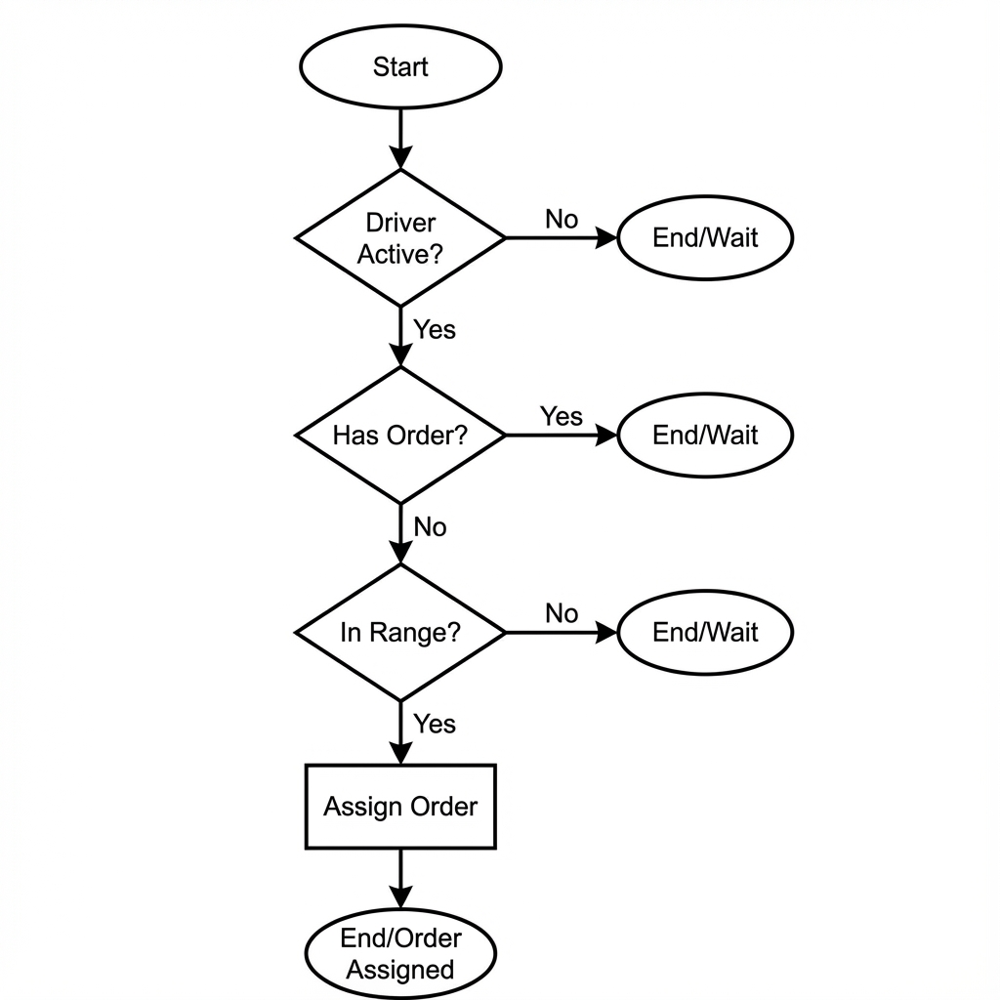
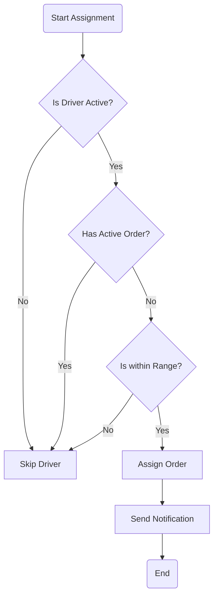

# Data Flow Diagrams (DFD)

This document visualizes how data moves through the Food Delivery System.

> **Note on Levels**:
> - **Level 0**: Context Diagram (The Big Picture).
> - **Level 1**: Main System Processes.
> - **Level 2**: Sub-processes (Detailed Breakdown).
> - **Level 3+**: Specific Logic/Algorithms (Code Level).

---

## Level 0: Context Diagram
**Scope**: Interaction between External Entities and the System.

---

## Level 1: System Overview
**Scope**: Major Functional Modules.

---

## Level 2: Order Processing (Detailed)
**Scope**: Breakdown of Process 2.0 (Order Process).

---

## Level 3: Driver Assignment Logic
**Scope**: Specific Algorithm for Process 2.4 & 2.5.

---

## Levels 4 & 5: Code Level Logic
At this level, DFDs become pseudocode or actual code.

### Level 4: Function Logic (Python)
**Process**: `calculate_total_price(items)`
1.  Initialize `total = 0`.
2.  Loop through each `item` in `items`.
3.  Fetch `price` from `menu_items` table.
4.  `total += price * quantity`.
5.  Return `total`.

### Level 5: Variable State (Memory)
**Process**: Inside the loop
-   `i=0`: `item_id=5`, `price=10.00`, `total=10.00`
-   `i=1`: `item_id=8`, `price=5.50`, `total=15.50`
